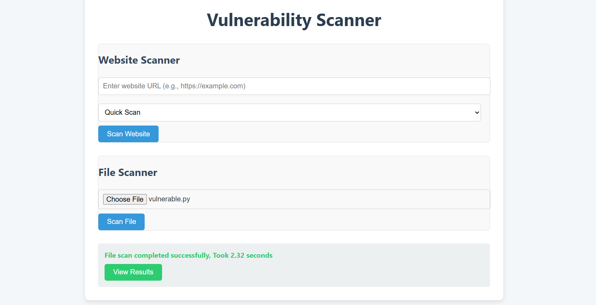
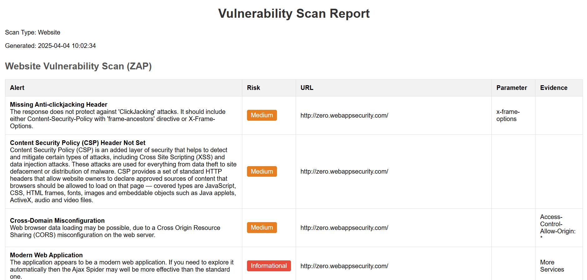
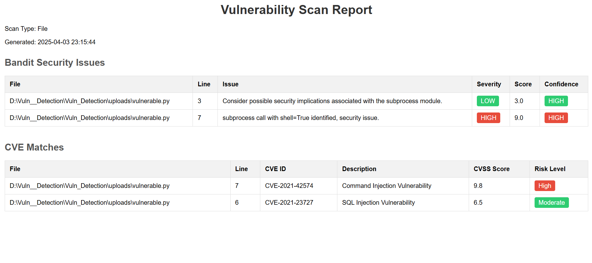

# 🔐 Vulnerability Scanner

A web-based vulnerability scanner that combines **static analysis (Bandit)**, **dynamic analysis (OWASP ZAP)**, and **custom CVE pattern matching** to analyze websites and uploaded files for security issues.

---

## 🚀 Features

- 🌐 **Website Scanner** using OWASP ZAP (Quick/Thorough modes)
- 🧪 **File Scanner** using Bandit with custom rules
- 📚 **CVE Matcher** for identifying known vulnerabilities using regex
- 📝 **HTML Report Generator** for readable vulnerability reports
- 🖥️ **Simple Web Interface** to scan files or URLs easily
- 📦 Modular codebase for easy extension

---

## 📸 Screenshots  
Here are some snapshots of the project:  

### **Vulnerability Scanner**  
  

### **Reports (Website)**  
  

### **Reports (File)**  
  

---

## 🛠️ Setup

### 1. Clone the Repository

```bash
git clone https://github.com/your-username/vulnerability-scanner.git
cd vulnerability-scanner
```

### 2. Run the setup script and start the web interface 
   
```bash
python setup.py
python web_interface.py
```

### Run a scan using the CLI

```bash
python main.py --path your/code/path --url http://your-target-url.com
```
